# Team Äähh? - Bauanleitung Tisch-Reservierungs-Tool

## Challenge
    Wie können wir durch smarte Devices Leonie dabei helfen, dass die Aufenthaltsqualität an der Hochschule steigt?

Ziel ist es, eine Lösung zu entwickeln, die die Aufenthaltsqualität an der Hochschule steigert.
Um mögliche Probleme an der Hochschule zu identifizieren, haben wir uns mit den Studierenden und Proffesoren unterhalten
und eine Umfrage durchgeführt. Dabei haben wir einige Probleme identifiziert, die wir zu unserer Personas zusammengefasst haben.

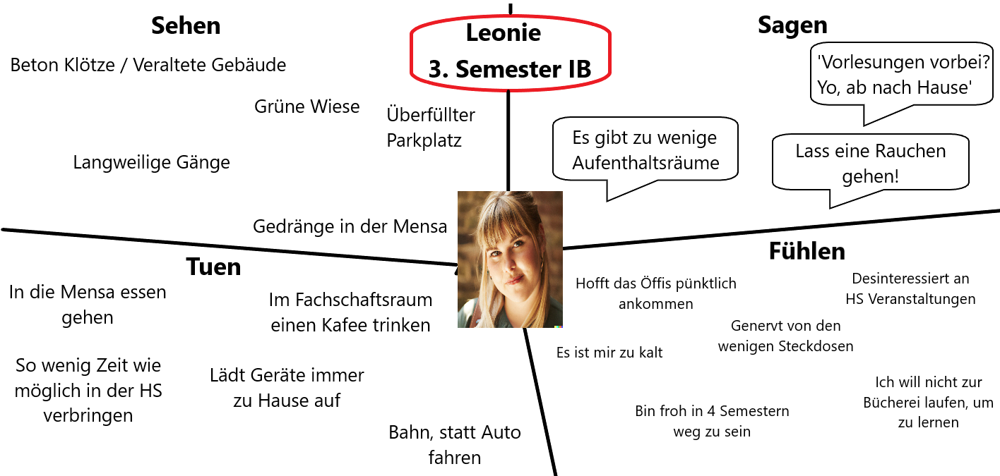

### Problem
Mit hilfe der Persona Leonie haben wir volgende POV erstellt:


    Wie können wir Leonie dabei helfen ihre Gruppenarbeit an der Hochschule stattfinden zu lassen, um effektiver ihre Aufgaben in Gruppen zu bearbeiten.

Leonie kann einen Tisch reservieren, damit sie Planen kann, wo und wann die Gruppenarbeit stattfinden kann und damit sie zu Beginn der Gruppenarbeit nicht erst einen freien Tisch suchen muss.

### Lösung
Um Leonie zu helfen, haben wir eine Tisch-Reservierungs-Tool entschieden. Damit kann Leonie einen Tisch reservieren und die Gruppenarbeit planen.  
Dazu haben wir einige Prototypen erstellt und mit Leonie getestet. Dabei haben wir die Prototypen immer weiter verbessert, bis wir eine Lösung gefunden haben, die Leonie gefällt.

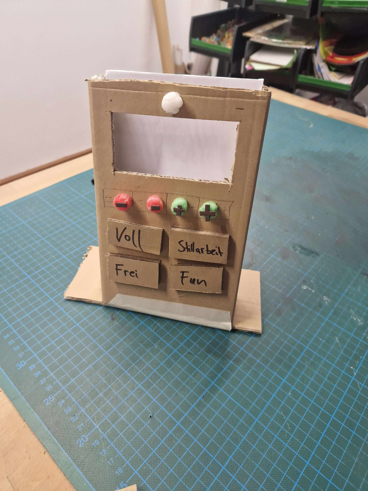

## Bauanleitung

### Material
- Raspberry Pi 3 Model B
- 4:3 Monitor
- 2x RFID Reader
- 2x Druckschalter
- Drehschalter
- Sperrholzplatten 3.5mm
- Holzbretter 10mm (Resteverwertung)
- MakerBeams
- Heißkleber
- Holzöl
- Acrylglasscheibe
- Neopixel LED Ring
- 1,3 " HD-IPS-TFT-LCD DISPLAY 
- 3D Druck Filament
- 2x ESP32
- 9V Batterie
- 5V Netzteil
- Kippschalter
- 2x 10k Ohm Widerstand
- Kabel
- WD40
- Lötzinn
- Unterlegscheiben
- Moosgummi
- Schraubfüße
- 5V Spannungswandler
- HDMI auf VGA Adapter
- Mehrfachsteckdose

### Werkzeug
- 3D Drucker
- Lasercutter
- Lötkolben
- Schraubenzieher
- Bohrmaschine
- Säge
- Schleifpapier
- Schraubzwingen
- Schrauben
- Gewindeschneider
- Zange
- Multitool

### Software
- Arduino IDE für beide ESP's mit Arduino interner Programmiersprache (C).
- Inkspace (Laser Cutter)
- Fusion 360 & Cura (3D-Drucker)
- Mosquitto
- Python3 auf dem Raspberry Pi

### Empfohlene Vorkenntnisse
- Erfahrung in den Programmiersprachen C, Python und JavaScript.
- Erfahrung mit Lötkolben
- Erfahrung mit Lasercutter
- Erfahrung mit 3D-Druckern
- Erfahrung mit verteilten Systemen (Speziell Broker und Socketverbindungen)

### Schritt 1: Schaltung bauen
#### Schaltung für das Wanddisplay mit RFID Reader, Druckschalter und Drehschalter
Wir haben den RFID Reader wie folgt eingebaut:
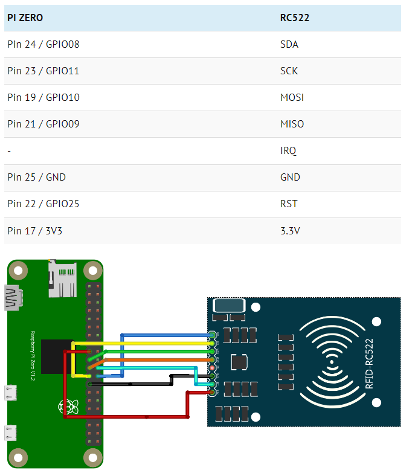

Der Drehknopf wurde wie folgt eingebaut: [Bildquelle](https://tutorials-raspberrypi.de/raspberry-pi-ky040-drehregler-lautstaerkeregler/)
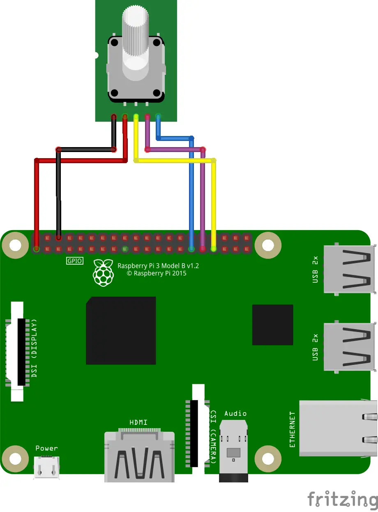

Die Buttons wurden mit einem Pulldown-Widerstand an noch freie GPIO-Pins des Raspberry Pi angeschlossen.
Am Ende sah die Schaltung wie folgt aus:

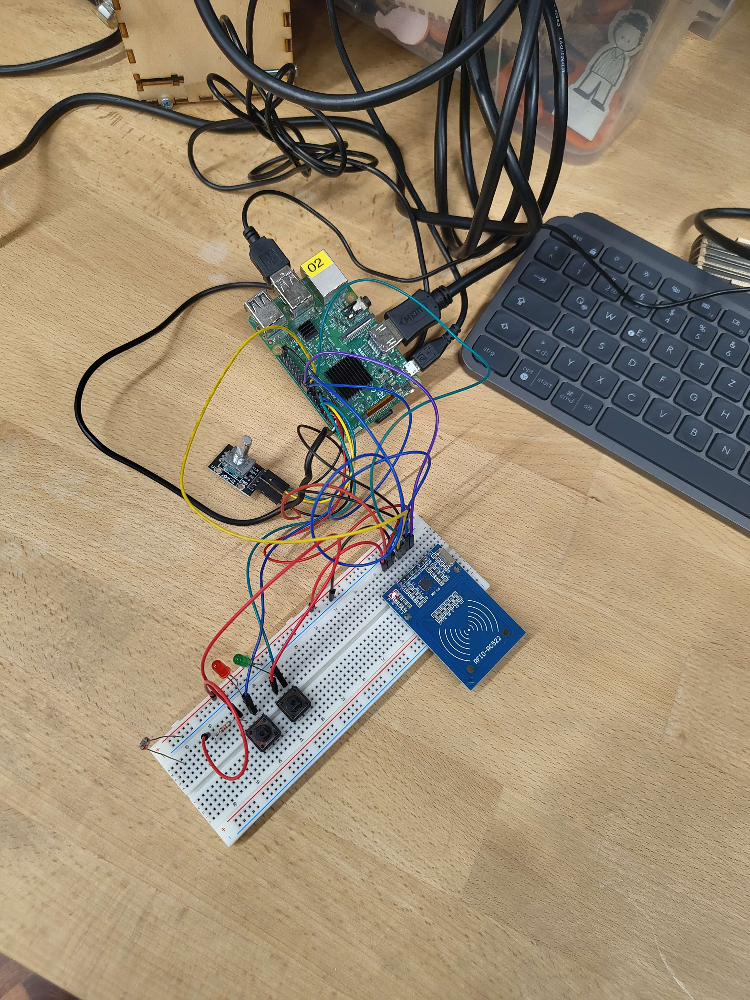
Zum Testen der Buttons wurden hier noch zusätzliche LEDs angeschlossen. Diese sind in der finalen Version jedoch nicht mehr eingebaut.

#### Schaltung für das Tischgerät mit RFID Reader, TFT Panel und Neopixel LED Ring
Der ESP32 wurde mit dem 1,3 " HD-IPS-TFT-LCD Display verbunden: [Bildquelle](https://joy-it.net/files/files/Produkte/SBC-LCD01/SBC-LCD01-Anleitung-29.09.2020.pdf)
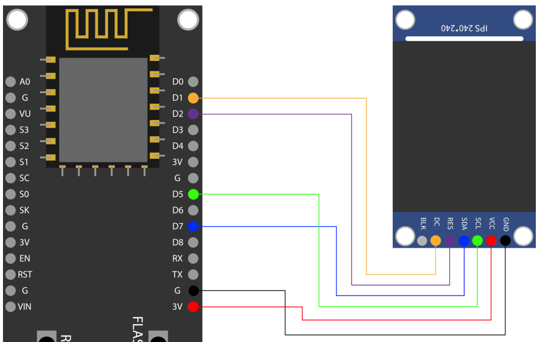

Der Neopixel LED Ring wurde wie folgt an den zweiten ESP32 eingebaut: [Bildquelle](https://blog.berrybase.de/neopixel-ring-mit-arduino-ansteuern-so-wirds-gemacht/)
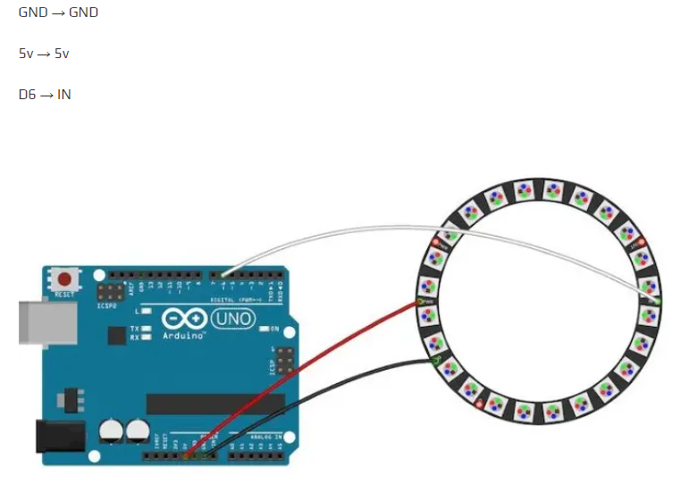

Der RFID Reader wurde auch an den zweiten ESP32 angeschlossen: [Bildquelle](https://www.electronicwings.com/esp32/rfid-rc522-interfacing-with-esp32)


### Schritt 2: Gehäuse bauen
#### Gehäuse für das Wanddisplay mit RFID Reader, Druckschalter und Drehschalter
1. Display aus Monitor ausbauen
2. Display, Druckschalter und Drehschalter vermessen und Frontplatte in Inkscape zeichnen
3. Frontplatte mit dem Lasercutter aus Sperrholz schneiden
4. Display und Drehschalter in die Frontplatte einbauen
5. Aufsatz für den Drehschalter in Autodesk Fusion 360 zeichnen
6. Aufsatz für den Drehschalter mit dem 3D Drucker drucken
7. Aufsatz für den Drehschalter mit dem Drehschalter verkleben
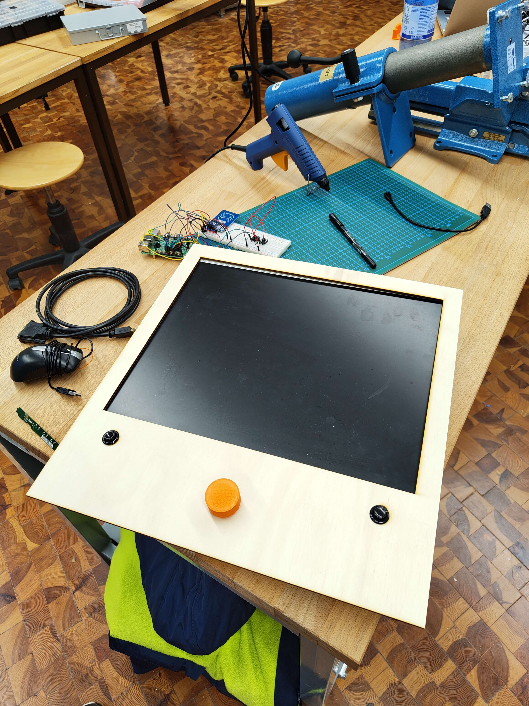
8. Standfuß für das Display aus zwei Holzbrettern zusägen und mit einer Holzleiste im 90° Winkel verschrauben
9. Unterseite des Standfußes mit Moosgummi bekleben, um rutschen zu verhindern
10. Hintere Abdeckung des Displays abschrauben und montagelöcher auf den Standfuß übertragen
11. Montagelöcher in den Standfuß bohren und mit dem Display verschrauben
12. 3 mm breite Nut mit 2 mm Abstand zum Rand in alle vier Seitenkanten auf Vorder- und Rückseite der Frontplatte fräsen, damit die Frontplatte in die Zwischenräume der MakerBeams passt
13. MakerBeams auf die richtige Länge für das Gehäuse zusägen
14. Abgesägten Enden der MakerBeams mit WD40 einsprühen und mit einem Gewindeschneider ein Gewinde schneiden
15. Frontplatte mit den MakerBeams verschrauben
16. Seitenwände und Rückwand aus Sperrholz zusägen, dabei gravieren wir gleich eine Nut für die MakerBeams auf alle Seitenkanten ein.
Hierbei ist zu beachten, dass der Lasercutter in x-Richtung schneller gravieren kann als in y-Richtung. Daher drehen wir die zurechtgeschnittenen Platten um 90°, um die Nut in y-Richtung zu gravieren.
17. RFID Reader Logo auf Seitenwand gravieren
18. MakerBeams Rahmen mit dem Standfuß verschrauben
19. RFID Reader an die Seitenwand mit dem Logo kleben
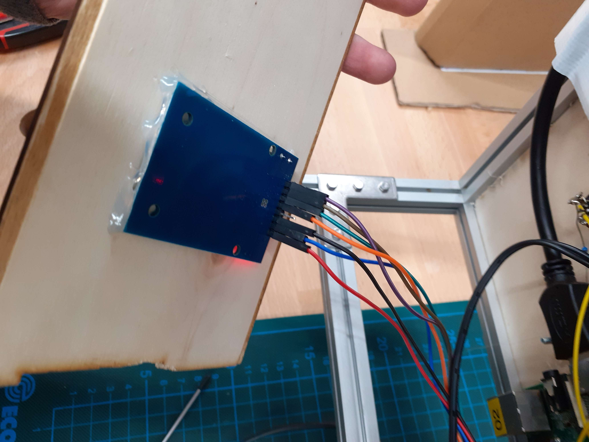
20. Seitenwände und Rückwand zwischen die MakerBeams einsetzen und mit den Schrauben der MakerBeams verschrauben
21. Raspberry Pi mit Schraubfüßen auf die Rückseite der Frontplatte kleben
22. Knöpfe und Widerstände an den Raspberry Pi anschließen und mit Lötzinn verlöten
23. Monitor Steuerplatine an die Seite des Standfußes kleben
24. HDMI auf VGA Adapter an Monitor anschließen
25. Monitor mit dem Raspberry Pi verbinden
26. Mehrfachsteckdose auf die Oberseite des Standfußes kleben
27. Raspberry Pi und Monitor an die Mehrfachsteckdose anschließen
28. Rückwand mit dem Standfuß verschrauben
29. Gehäuse mit Holzöl einölen
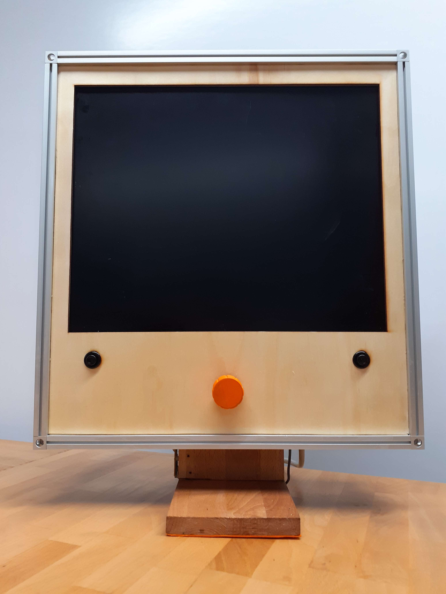

#### Gehäuse für das Tischgerät mit RFID Reader, TFT Panel und Neopixel LED Ring
1. LED Ring, TFT Panel und RFID Reader vermessen
2. Gehäuse in Autodesk Fusion 360 zeichnen, hierbei Nut zum Verschließen des Gehäuses nicht vergessen und genügend Platz für Kabel, ESP32 und Batterie lassen
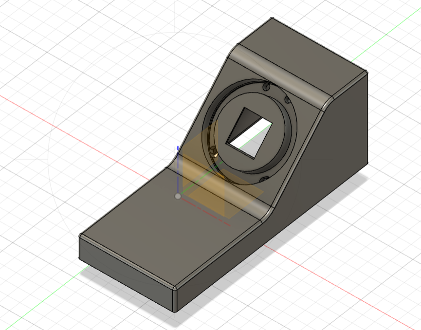
3. Testdruck des oberen Teils des Gehäuses mit dem 3D Drucker machen, damit der LED Ring, zwei Plexiglasringe und das TFT Panel in das Gehäuse passen
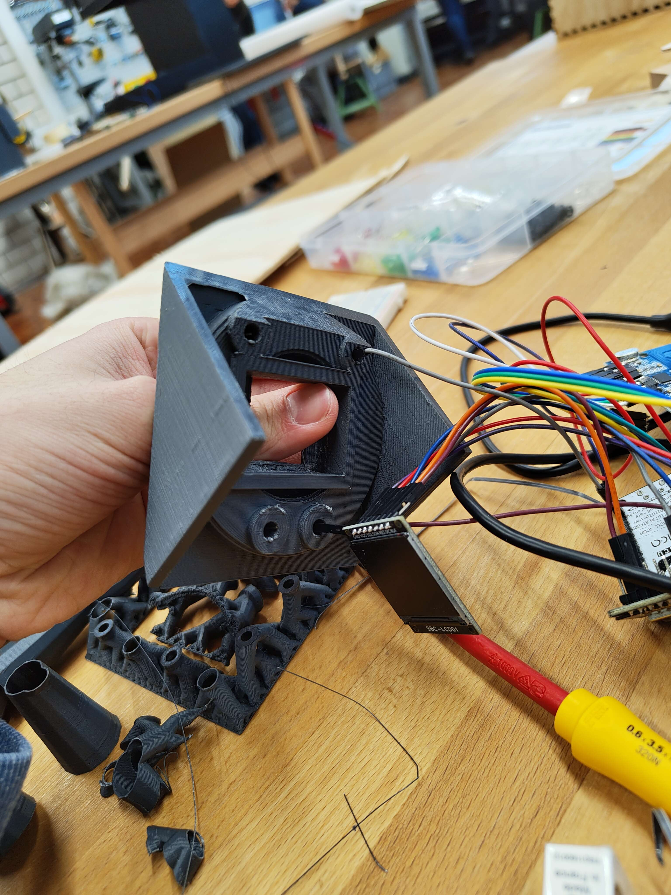
5. Gehäuse mit dem 3D Drucker drucken
5. Stützmaterial entfernen und vergessenes Loch für Batterieschalter nachbohren
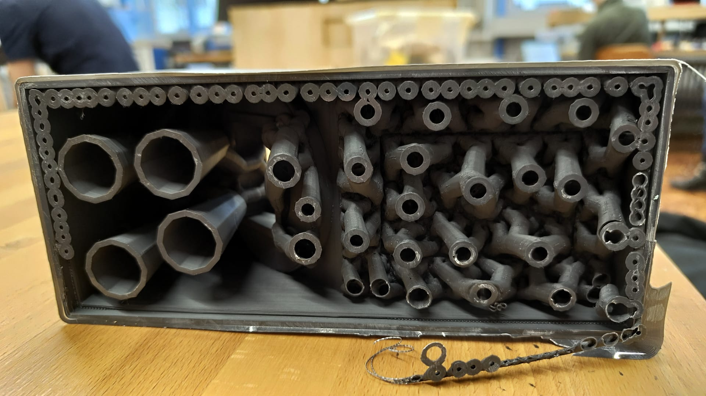
6. Plexiglasringe mit dem Lasercutter ausschneiden
7. TFT Panel, LED Ring, RFID Reader und Plexiglasringe in das Gehäuse einbauen und mit Heißkleber fixieren
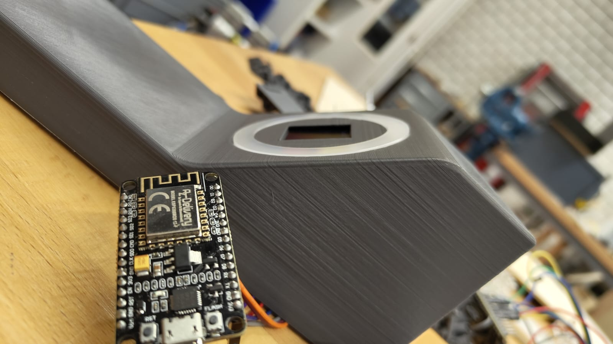
8. ESP32 mit dem TFT Panel verbinden
9. ESP32 mit dem RFID Reader und dem LED Ring verbinden
10. ESPs mit Heißkleber im Gehäuse befestigen
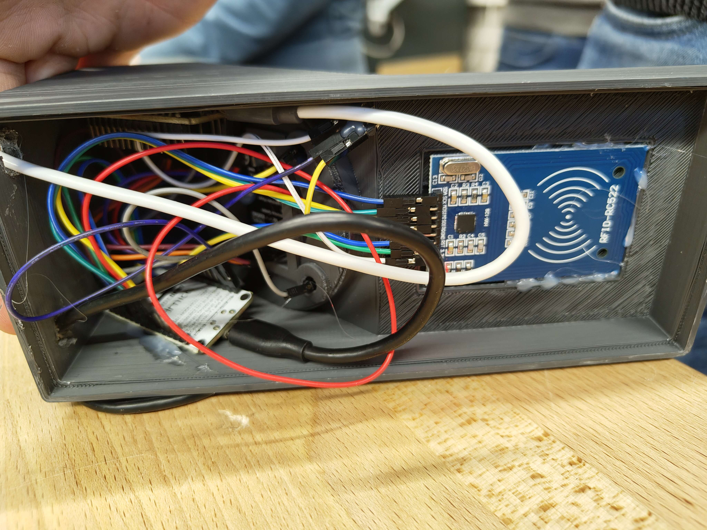
11. 9V Batterie mit dem Batterieschalter verbinden und mit Spannungswandler auf 5V herunterregeln
12. 5V Spannungswandler mit dem ESPs verbinden
13. Batterieschalter durch das Loch im Gehäuse führen und mit dem Gehäuse verschrauben
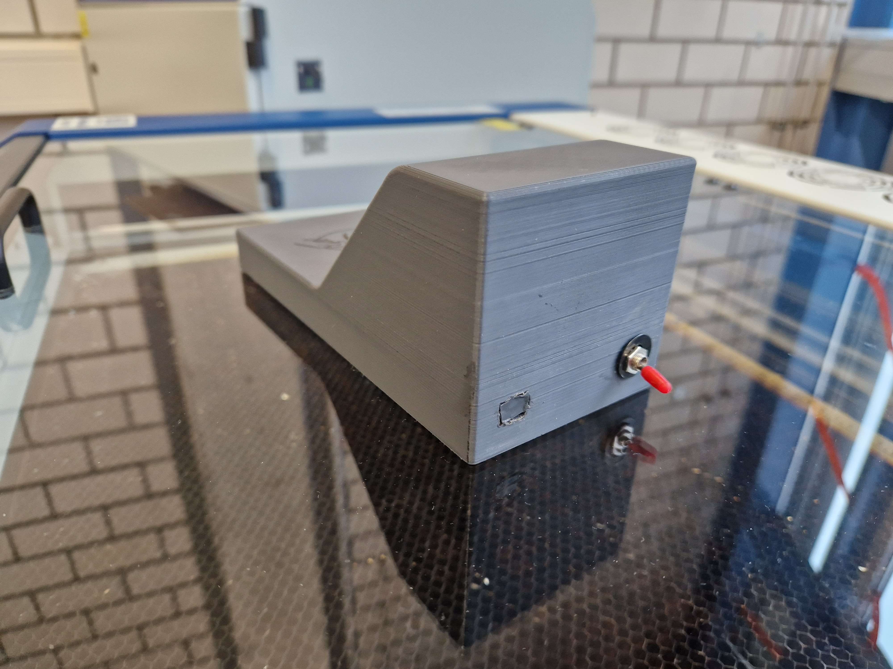
14. Deckel für das Gehäuse in Inkscape zeichnen, hierbei Aussparung zum Öffnen des Gehäuses nicht vergessen
15. Deckel mit dem Lasercutter aus dunklem Acrylglas schneiden
16. Deckel in das Gehäuse einsetzen
17. RFID Reader Logo mit Schneidplotter ausschneiden und auf das Gehäuse kleben
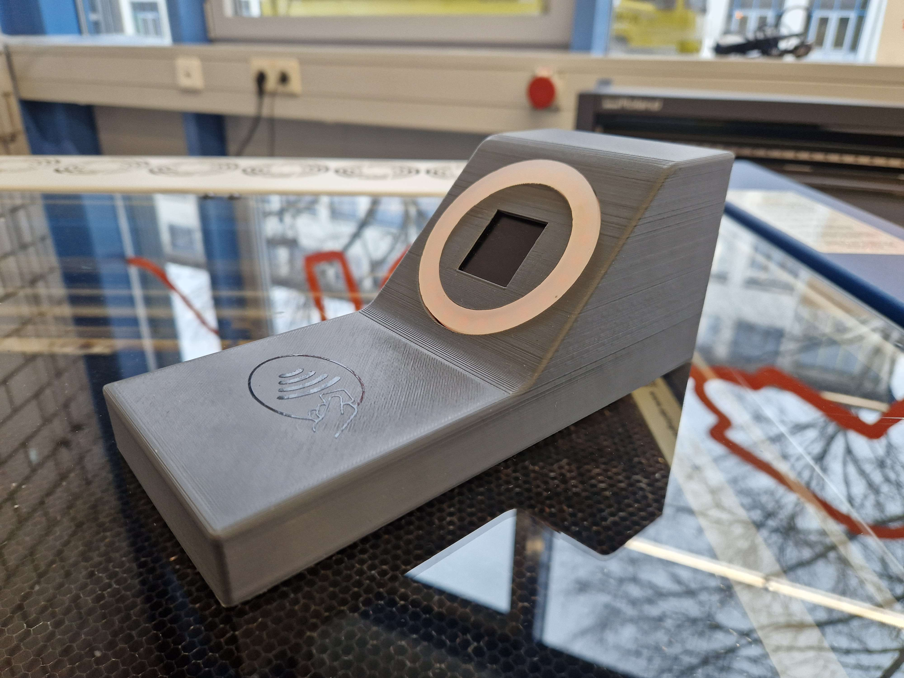

### Code
#### Frontend - Display
Die Benutzeroberflächen im Frontend werden alle mit HTML, CSS und JavaScript realisiert. Die Verbindung zum Backend geschieht über Socket.IO Socket-Verbindungen.

Der Nutzer kann hier zu den einzelnen Tischen im Denkraum navigieren und damit aktuelle Reservierungen einsehen.

Durch diese Webansicht navigiert der Nutzer, um seine Reservierung zu konfigurieren.

Diese Webansicht zeigt die vom Nutzer ausgewählte Reservierungskonfiguration an. Der Nutzer kann nun seine Reservierung abschließen.

#### Backend
Das Backend wird auf dem Raspberry Pi ausgeführt. Es wurde vollständig in Python geschrieben und verwendet das Webframework Flask mit Socket.IO. Zur Speicherung und Verwaltung von Reservierungen wird eine SQLite Datenbank verwendet. Weiterhin wird die MQTT Library paho-mqtt benötigt, damit das Tischgerät mit dem Backend kommunizieren kann.

Folgende Libraries werden mit den aufgelisteten Versionen als Requirements benötigt:

```
Flask>=2.2.2
Flask-SocketIO==5.3.6
RPi.GPIO==0.7.0
paho-mqtt~=1.6.1
```

#### Das Tischgerät
Das Tischgerät besteht aus 2 ESP32. Der Code ist in der Arduino IDE mit C geschrieben worden und wird auch darüber auf die beiden ESP32 hochgeladen. 
